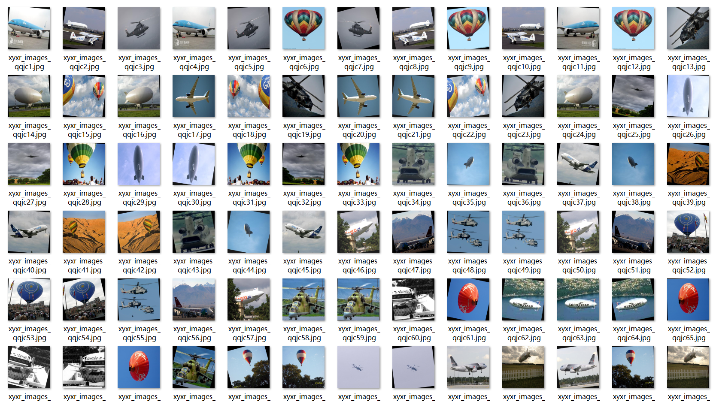
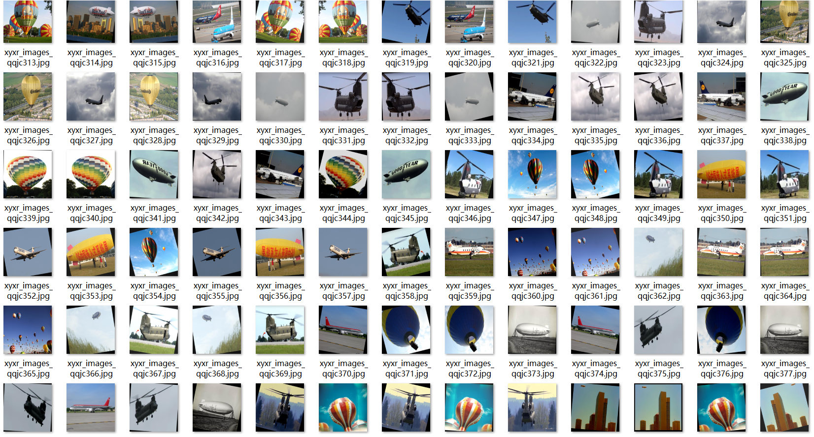

# 4 Types Aerial Flying Object Dataset: 3561 Images, VOC+YOLO (Thermal Balloon Airship Aircraft Helicopter)

The dataset consists of 3561 images in VOC and YOLO formats, covering four types of aerial flying objects: balloons, airships, helicopters, and planes. The dataset is organized into three folders for image storage, XML files, and txt files.

The JPEGImages folder contains a total of 3561 JPEG images.

The Annotations folder has a total of 3561 XML files, each containing the necessary annotations for the dataset.

The labels folder has a total of 3561 txt files, which contain the label information for each image.

There are a total of 4 categories in the dataset: airship, balloon, helicopter, and plane. The number of frames for each category is as follows:
- airship: 942
- balloon: 2094
- helicopter: 993
- plane: 999

The total number of frames across all categories is 5028.

All images in the dataset are of high resolution clarity.

The images have been enhanced to ensure they can be used for training models or weights. However, unenhanced images have been extracted and stored separately in the dataset. There are approximately 844 such images.

The GitHub repository location is datasets_sl.

The shape of the labels is rectangular boxes, used for target detection recognition.

Important Note: This dataset does not guarantee the accuracy or precision of any trained models or weight files. It only provides accurate and reasonable annotations.

Special Disclaimer: This dataset does not guarantee any accuracy or precision in the models or weights that are trained on this dataset. The dataset is intended to provide accurate and reasonable annotations only.

## Images

---

Here is a pay link on Stripe (https://buy.stripe.com/3cs8yP7sY87d0vu9AB). Please contact me lonlonago@foxmail.com after funding $89, and I will send you a complete data files, thank you!

